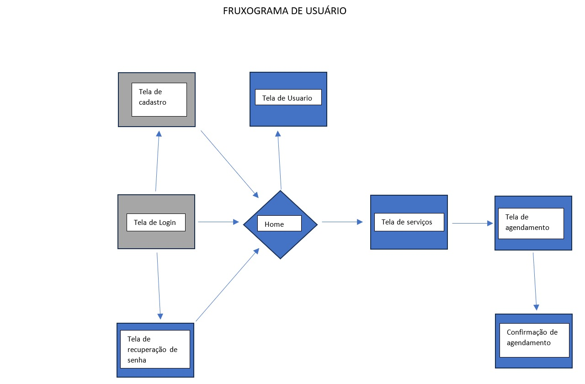
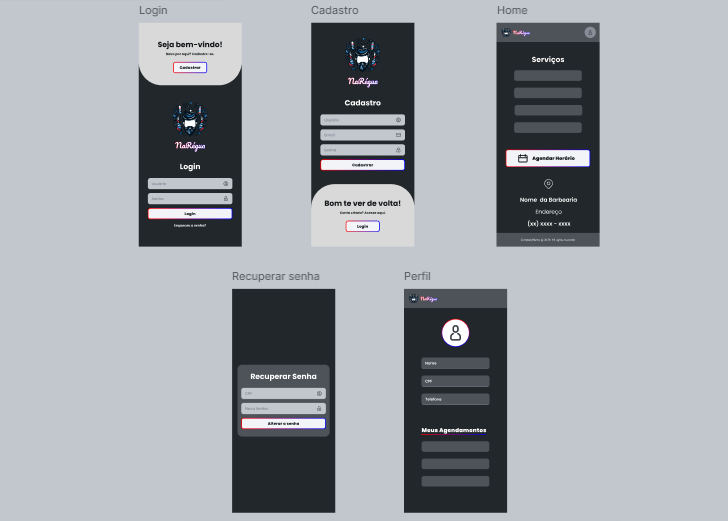

# Projeto de interface

 ## User flow

Esse fluxo de usuário foi pensado para deixar a experiência mais fácil e intuitiva. Cada etapa ajuda a guiar o usuário sem complicação, garantindo que ele chegue onde precisa sem muito esforço. O objetivo é minimizar obstáculos, tornar a navegação natural e facilitar as ações que ele quer realizar.

### Diagrama de fluxo

O diagrama de fluxo foi criado para ajudar a organizar as ideias antes de montar o user flow e os wireframes. Ele funciona como um mapa, mostrando os caminhos que o usuário pode seguir, os pontos de decisão e possíveis desafios. Com isso, conseguimos prever ajustes, tornar a navegação mais fluida e facilitar a criação da interface sem retrabalho

## Wireframes

O wireframe foi criado para dar uma visão clara de como a interface vai funcionar antes de investir tempo no design final. Ele ajuda a organizar os elementos da tela, definir a hierarquia das informações e garantir que a navegação faça sentido. É como um esboço que evita refação e facilita ajustes rápidos antes de partir para algo mais visual e detalhado

## Interface do sistema

Visão geral da interação do usuário por meio das telas do sistema. Apresente as principais interfaces da plataforma em sua versão final.

### Tela principal do sistema

Descrição da tela principal do sistema.

> Insira aqui a tela principal do sistema

###  Telas do processo 1

Descrição da tela relativa à atividade 1 do processo 1.

> Insira aqui a tela da atividade 1

Descrição da tela relativa à atividade 2 do processo 1.

> Insira aqui a tela da atividade 2

### Telas do processo 2

Descrição da tela relativa à atividade 1 do processo 2.

> Insira aqui a tela da atividade 1

Descrição da tela relativa à atividade 2 do processo 2.

> Insira aqui a tela da atividade 2
