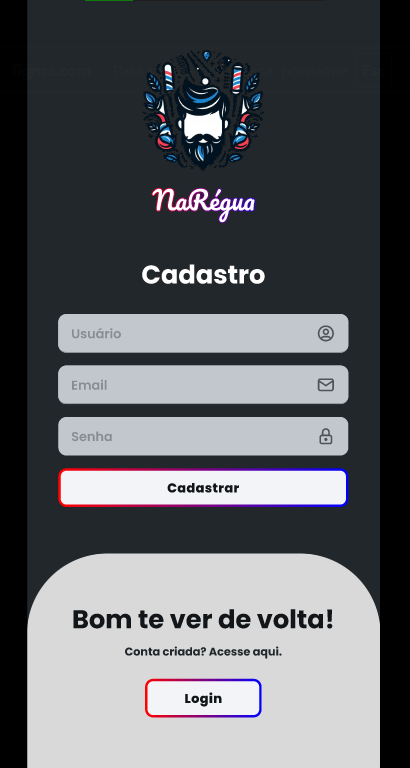
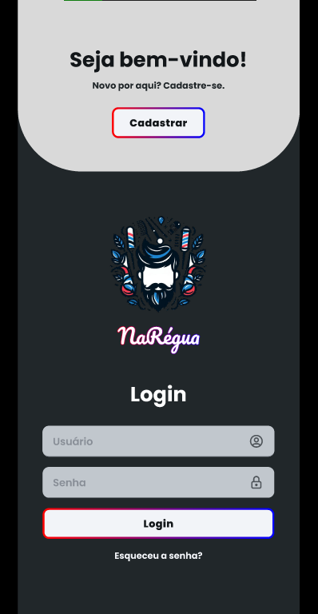
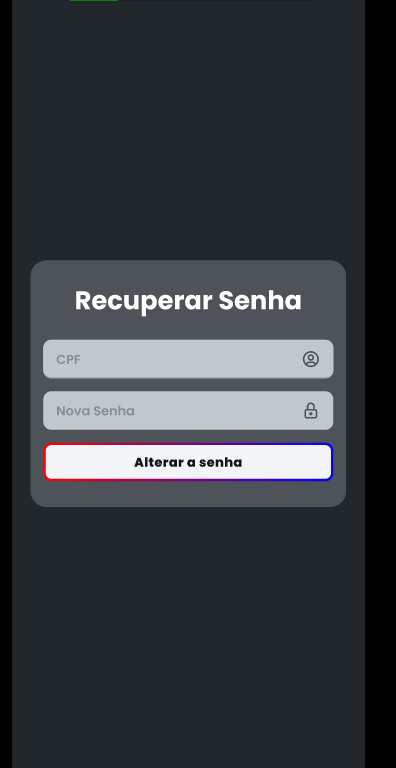

# Projeto de interface

 ## User flow

Esse fluxo de usuário foi pensado para deixar a experiência mais fácil e intuitiva. Cada etapa ajuda a guiar o usuário sem complicação, garantindo que ele chegue onde precisa sem muito esforço. O objetivo é minimizar obstáculos, tornar a navegação natural e facilitar as ações que ele quer realizar.

### Diagrama de fluxo

O diagrama de fluxo foi criado para ajudar a organizar as ideias antes de montar o user flow e os wireframes. Ele funciona como um mapa, mostrando os caminhos que o usuário pode seguir, os pontos de decisão e possíveis desafios. Com isso, conseguimos prever ajustes, tornar a navegação mais fluida e facilitar a criação da interface sem retrabalho

## Wireframes

O wireframe foi criado para dar uma visão clara de como a interface vai funcionar antes de investir tempo no design final. Ele ajuda a organizar os elementos da tela, definir a hierarquia das informações e garantir que a navegação faça sentido. É como um esboço que evita refação e facilita ajustes rápidos antes de partir para algo mais visual e detalhado

## Interface do sistema

Visão geral da interação do usuário por meio das telas do sistema. Apresente as principais interfaces da plataforma em sua versão final.

### Tela principal do sistema

Tela Home, utilizada para agendar os serviços da barbearia, e mostrar os produtos disponiveis para compra.

###  Telas do processo 1

Tela de cadastro, utilizada para o usuário se cadastrar para utilizar a aplicação.

Tela de login, utlizada para o usário possa entrar em sua conta para utilizar a aplicação.

Tela de recuperação de senha, utlizada para o usário consiga redefinir a sua senha caso ele não se lembre dela.

### Telas do processo 2

Tela do perfil, utilizada para que o usuário consiga ver os seus dados, agendamentos próximos e o histórico de agendamentos que já foram realizados

