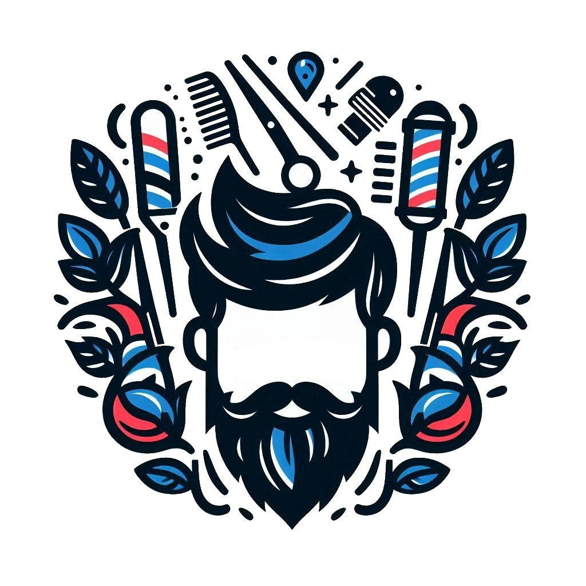

# Template padrão da aplicação

Pré-requisitos: <a href="02-Especificacao.md"> Especificação do projeto</a>, <a href="03-Metodologia.md"> Metodologia</a>, <a href="05-Projeto-interface.md"> Projeto de interface</a>

## 🧩 Template padrão da aplicação

A aplicação segue um layout padrão reutilizado em todas as páginas, garantindo consistência visual e responsividade.

### 🎨 Identidade Visual

- **Fonte da interface:** Poppins  
- **Fonte da logo:** Pacifico  
- **Cores utilizadas:**
  - `#121619`
  - `#F2F4F8`
  - `#FFFFFF`
  - `#4D5358`
  - `#C1C7CD`
  - `#878D96`
  - `#21272A`
  - `#343A3F`
  - Gradiente entre `#FF0000` e `#0000FF`

### 📱 Responsividade

- Layout adaptável para diferentes tamanhos de tela (mobile, tablet e desktop).

### 🔘 Iconografia

- A logo do NaRégua combina elementos clássicos de barbearia, como tesoura, pente, navalha e o poste listrado, com o rosto estilizado de um homem com cabelo e barba marcantes. As cores vermelho, azul e branco reforçam a identidade visual inspirada nas barbearias tradicionais.

