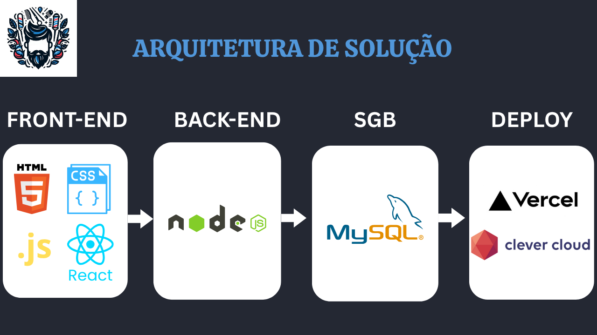
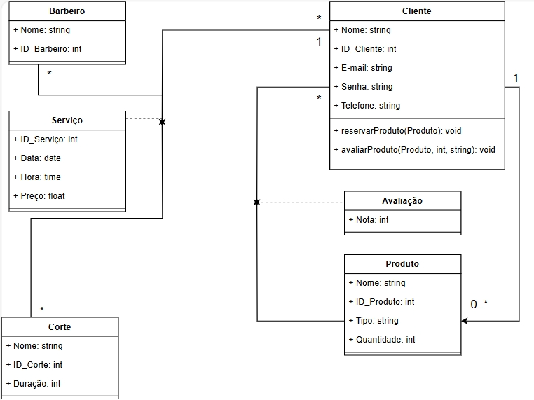
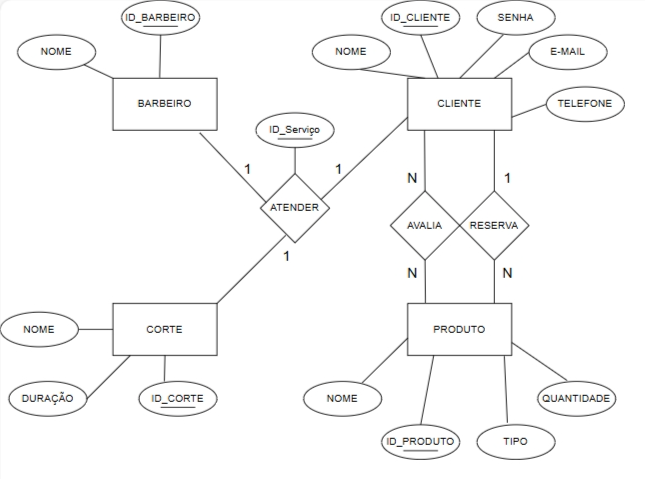
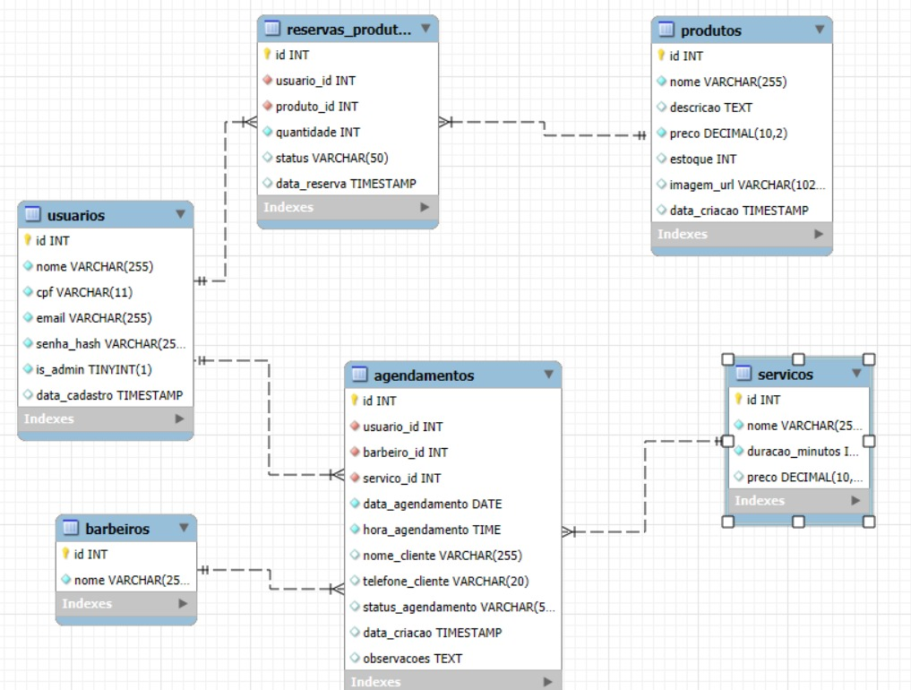

# Arquitetura da solução

<span style="color:red">Pré-requisitos: <a href="05-Projeto-interface.md"> Projeto de interface</a></span>




## Diagrama de classes





##  Modelo de dados


### Modelo ER





### Esquema relacional


 


---


### Modelo físico


```sql
-- Script final para criar o banco de dados e todas as tabelas.

CREATE DATABASE IF NOT EXISTS bncjzdu8swnlmwhhwnp1 CHARACTER SET utf8mb4 COLLATE utf8mb4_unicode_ci;
USE bncjzdu8swnlmwhhwnp1;

-- Tabela de Usuários
CREATE TABLE IF NOT EXISTS usuarios (
    id INT UNSIGNED AUTO_INCREMENT PRIMARY KEY,
    nome VARCHAR(255) NOT NULL,
    cpf VARCHAR(11) NOT NULL,
    email VARCHAR(255) NOT NULL,
    senha_hash VARCHAR(255) NOT NULL,
    is_admin BOOLEAN NOT NULL DEFAULT FALSE,
    data_cadastro TIMESTAMP DEFAULT CURRENT_TIMESTAMP,
    CONSTRAINT uc_cpf UNIQUE (cpf),
    CONSTRAINT uc_email UNIQUE (email)
);

-- Tabela de Barbeiros
CREATE TABLE IF NOT EXISTS barbeiros (
    id INT UNSIGNED AUTO_INCREMENT PRIMARY KEY,
    nome VARCHAR(255) NOT NULL
);

-- Tabela de Serviços
CREATE TABLE IF NOT EXISTS servicos (
    id INT UNSIGNED AUTO_INCREMENT PRIMARY KEY,
    nome VARCHAR(255) NOT NULL,
    duracao_minutos INT UNSIGNED NOT NULL,
    preco DECIMAL(10, 2) NULL
);

-- Tabela de Agendamentos
CREATE TABLE IF NOT EXISTS agendamentos (
    id INT UNSIGNED AUTO_INCREMENT PRIMARY KEY,
    usuario_id INT UNSIGNED NOT NULL,
    barbeiro_id INT UNSIGNED NOT NULL,
    servico_id INT UNSIGNED NOT NULL,
    data_agendamento DATE NOT NULL,
    hora_agendamento TIME NOT NULL,
    nome_cliente VARCHAR(255) NULL,
    telefone_cliente VARCHAR(20) NULL,
    status_agendamento VARCHAR(50) DEFAULT 'Confirmado',
    data_criacao TIMESTAMP DEFAULT CURRENT_TIMESTAMP,
    observacoes TEXT NULL,
    FOREIGN KEY (usuario_id) REFERENCES usuarios(id) ON DELETE CASCADE ON UPDATE CASCADE,
    FOREIGN KEY (barbeiro_id) REFERENCES barbeiros(id) ON DELETE RESTRICT ON UPDATE CASCADE,
    FOREIGN KEY (servico_id) REFERENCES servicos(id) ON DELETE RESTRICT ON UPDATE CASCADE,
    CONSTRAINT uc_agendamento_barbeiro_horario UNIQUE (barbeiro_id, data_agendamento, hora_agendamento)
);

-- Tabela de Produtos
CREATE TABLE IF NOT EXISTS produtos (
    id INT UNSIGNED AUTO_INCREMENT PRIMARY KEY,
    nome VARCHAR(255) NOT NULL,
    descricao TEXT,
    preco DECIMAL(10, 2) NOT NULL,
    estoque INT UNSIGNED DEFAULT 0,
    imagem_url VARCHAR(1024),
    data_criacao TIMESTAMP DEFAULT CURRENT_TIMESTAMP
);

-- NOVA TABELA DE RESERVAS DE PRODUTOS
CREATE TABLE IF NOT EXISTS reservas_produtos (
    id INT UNSIGNED AUTO_INCREMENT PRIMARY KEY,
    usuario_id INT UNSIGNED NOT NULL,
    produto_id INT UNSIGNED NOT NULL,
    quantidade INT UNSIGNED NOT NULL,
    status VARCHAR(50) DEFAULT 'Ativa', -- Ex: Ativa, Retirada, Cancelada
    data_reserva TIMESTAMP DEFAULT CURRENT_TIMESTAMP,
    FOREIGN KEY (usuario_id) REFERENCES usuarios(id) ON DELETE CASCADE,
    FOREIGN KEY (produto_id) REFERENCES produtos(id) ON DELETE RESTRICT
);

-- Inserção de Dados Iniciais
INSERT IGNORE INTO usuarios (nome, cpf, email, senha_hash, is_admin) VALUES
('Admin', '00000000000', 'admin@naregua.com', '$2b$10$g9pxUF0H5JzhUvYJr.f2u.e7V3jbDT2yWGXz5c05KexoNPAGWwgOG', TRUE);
INSERT IGNORE INTO barbeiros (nome) VALUES ('Lucas');
INSERT IGNORE INTO produtos (nome, descricao, preco, estoque, imagem_url) VALUES
('Gel Fixador Men Essence', 'O Gel Fixador Men Essence Fixação Megaforte garante 24h de controle do penteado, sem ressecar os fios.', 19.90, 15, 'https://www.salonline.com.br/ccstore/v1/images/?source=/file/v7405439105588429855/products/32243%20GEL%20FORTE%20MEN%20300G%20(1).jpg&height=940&width=940'),
('Pomada Modeladora Efeito Matte', 'Ideal para estilizar o cabelo com acabamento fosco e natural. Alta fixação e fácil remoção.', 25.50, 20, 'https://farmagora.vteximg.com.br/arquivos/ids/202595-800-800/726946.jpg?v=638227903321000000'),
('Shampoo Anticaspa Clear Man', 'Tratamento eficaz contra a caspa, com sensação de frescor e limpeza profunda.', 22.00, 30, 'https://m.media-amazon.com/images/I/61LONPQTY9L._UF1000,1000_QL80_.jpg'),
('Óleo para Barba Hidratante', 'Hidrata, amacia e dá brilho à barba, com uma fragrância amadeirada suave.', 35.00, 12, 'https://cdn.sistemawbuy.com.br/arquivos/0f2a4340b7f91641e49c7e5b8a1c598a/produtos/MUA5KEI6/a-leo-para-barba-urban-men-30ml-1-637044ecc520a.jpg');

-- --- SERVIÇOS DE CORTE ---
INSERT IGNORE INTO servicos (nome, duracao_minutos, preco) VALUES
('Corte Social (Tesoura e Máquina)', 30, 40.00),
('Corte Degradê / Fade', 45, 55.00),
('Corte na Navalha', 50, 60.00);

-- --- SERVIÇOS DE BARBA ---
INSERT IGNORE INTO servicos (nome, duracao_minutos, preco) VALUES
('Barba Simples (Aparar e alinhar)', 20, 30.00),
('Toalha Quente e Navalha (Tradicional)', 40, 55.00);

-- --- COMBOS ---
INSERT IGNORE INTO servicos (nome, duracao_minutos, preco) VALUES
('Combo: Corte Degradê + Barba Simples', 60, 80.00),
('Combo: Corte Social + Barboterapia', 70, 90.00);

-- --- TRATAMENTOS E ESTÉTICA ---
INSERT IGNORE INTO servicos (nome, duracao_minutos, preco) VALUES
('Luzes / Mechas Masculinas', 90, 130.00),
('Platinado Masculino (Cabelo Curto)', 120, 180.00),
('Relaxamento Capilar', 60, 75.00),
('Depilação de Nariz e Orelha (Cera)', 15, 20.00);

-- --- PACOTES ESPECIAIS ---
INSERT IGNORE INTO servicos (nome, duracao_minutos, preco) VALUES
('Dia do Noivo (Corte, Barba, Sobrancelha e Limpeza de Pele)', 180, 350.00),
('Pacote Pai e Filho (2 Cortes)', 70, 85.00);
```
Esse script deverá ser incluído em um arquivo .sql na pasta [de scripts SQL](../src/db).


## Tecnologias


| **Dimensão**   | **Tecnologia**  |
| ---            | ---             |
| Front-end      | HTML + CSS + JS + React |
| Back-end       | Node.js         |
| SGBD           | MySQL           |
| Deploy         | Vercel e Clever Cloud         |


## Hospedagem

1. **Organização do Repositório no GitHub.**

- Verificação da estrutura do projeto para garantir que todos os arquivos necessários estejam organizados.

- Se ainda não estiver no GitHub, o projeto será versionado e enviado para um repositório (público ou privado).

2. **Criação da Conta na Vercel e Integração.**

- Criação de uma conta na Vercel (via e-mail ou conexão direta com o GitHub).

- Integração do GitHub à conta da Vercel para permitir a seleção de repositórios e o deploy automático.

3. **Importação do Projeto para a Vercel.**

- Importação do repositório do projeto pela Vercel.

- A Vercel identificará automaticamente o tipo de projeto (HTML/CSS/JS, React, Next.js, etc.).

- Ajuste manual das configurações de build e de saída, se necessário.

4. **Configuração do Deploy Contínuo.**

- Início do primeiro deploy após a configuração da importação.

- Configuração da Vercel para realizar deploys automáticos a cada novo push ou merge na branch principal do repositório.

5. **Geração do Link de Acesso.**

- A Vercel fornecerá um link público após o deploy, permitindo o acesso à plataforma.

- Possibilidade de configurar um domínio personalizado posteriormente, se desejado.

6. **Testes Finais e Verificação.**

- Verificação do funcionamento da plataforma já hospedada, testando os principais fluxos e links.

- Correção de erros identificados e implantação automática de novas versões pela Vercel.


## Qualidade de software

Com base nos levamentamentos adquiridos pela equipe, para um site bem estruturado, as qualidades de Software podem ser descritas com base em modelos como a ISO/IEC 25010, que define atributos de qualidade como funcionalidade, usabilidade, desempenho, confiabilidade, segurança e portabilidade.

**FUNCIONALIDADE**
- O sistema deve permitir que usuários agendem horários com barbeiros disponíveis, exibindo corretamente as datas e horários.
- Deve permitir cadastro, login, escolha de serviços, agendamento, cancelamento e notificações.
- Integração com sistemas de pagamento, calendários e redes sociais.

**USABILIDADE**
- Interface intuitiva e responsiva tanto em desktop quanto mobile.
- Compatível com leitores de tela mobile e com boa navegação por desktop.
- Layout moderno, com feedback visual

**DESEMPENHO E EFICIÊNCIA**
- Páginas devem ter uma ótima atualização.
- Deve suportar picos de acesso simultâneos.
- Backend otimizado para não sobrecarregar o servidor e dando uma melhora no desempenho.

**CONFIABILIDADE**
- Sistema com uptime muito bom.
- Backups semanais e sistema de recuperação em caso de falhas.

**SEGURANÇA**
- Dados dos usuários (como telefone e histórico de agendamentos) protegidos com criptografia.
- Login com senha forte.

**PORTABILIDADE**
- Pode ser usado em diferentes navegadores e dispositivos.
- Funcionar em Android, iOS, Windows, Linux, etc. 
