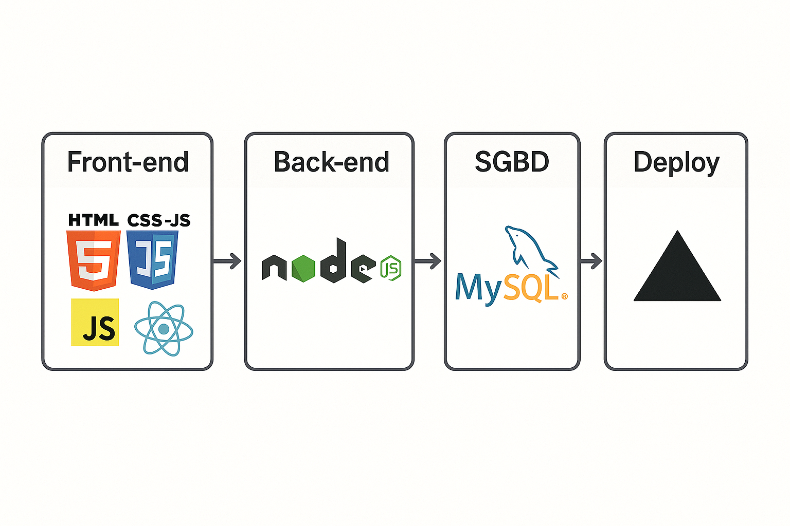
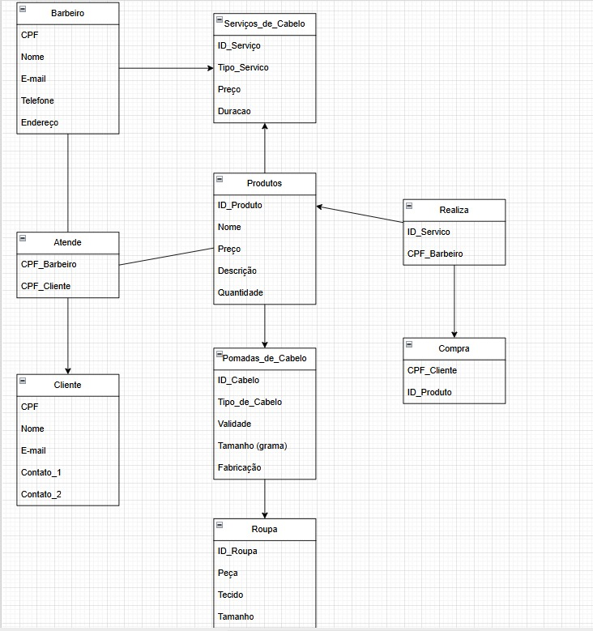
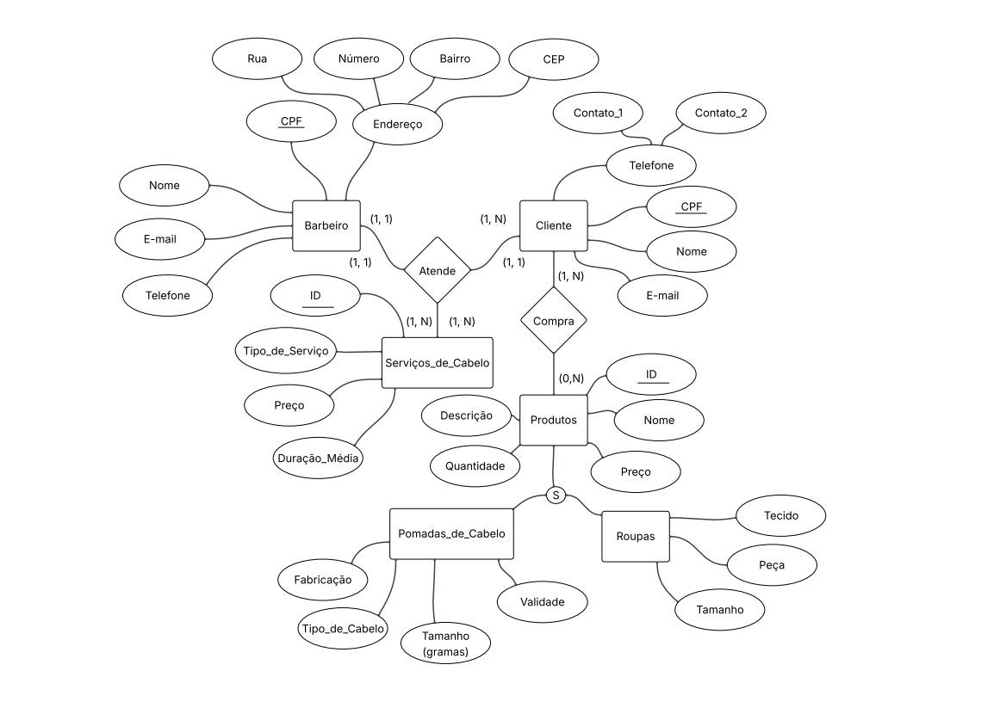
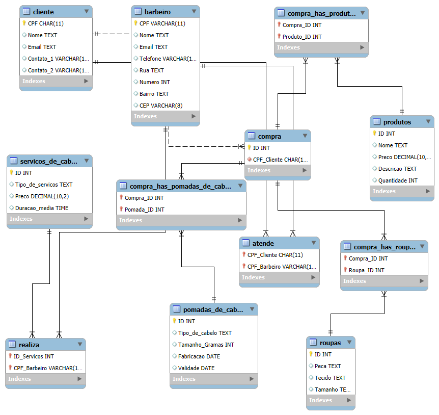

# Arquitetura da solução

<span style="color:red">Pré-requisitos: <a href="05-Projeto-interface.md"> Projeto de interface</a></span>

Definição de como o software é estruturado em termos dos componentes que fazem parte da solução e do ambiente de hospedagem da aplicação.



## Diagrama de classes

O diagrama de classes ilustra graficamente a estrutura do software e como cada uma das classes estará interligada. Essas classes servem de modelo para materializar os objetos que serão executados na memória.



##  Modelo de dados

O desenvolvimento da solução proposta requer a existência de bases de dados que permitam realizar o cadastro de dados e os controles associados aos processos identificados, assim como suas recuperações.

Utilizando a notação do DER (Diagrama Entidade-Relacionamento), elabore um modelo, usando alguma ferramenta, que contemple todas as entidades e atributos associados às atividades dos processos identificados. Deve ser gerado um único DER que suporte todos os processos escolhidos, visando, assim, uma base de dados integrada. O modelo deve contemplar também o controle de acesso dos usuários (partes interessadas nos processos) de acordo com os papéis definidos nos modelos do processo de negócio.

Apresente o modelo de dados por meio de um modelo relacional que contemple todos os conceitos e atributos apresentados na modelagem dos processos.

### Modelo ER

O Modelo ER representa, por meio de um diagrama, como as entidades (coisas, objetos) se relacionam entre si na aplicação interativa.



### Esquema relacional

O Esquema Relacional corresponde à representação dos dados em tabelas juntamente com as restrições de integridade e chave primária.
 


---


### Modelo físico

Insira aqui o script de criação das tabelas do banco de dados.


```sql
-- Criação do schema
CREATE SCHEMA IF NOT EXISTS `mydb` DEFAULT CHARACTER SET utf8mb4;
USE `mydb`;

-- Tabela Barbeiro
CREATE TABLE `Barbeiro` (
  `CPF` VARCHAR(11) NOT NULL,
  `Nome` TEXT,
  `Email` TEXT,
  `Telefone` VARCHAR(11),
  `Rua` TEXT,
  `Numero` INT,
  `Bairro` TEXT,
  `CEP` VARCHAR(8),
  PRIMARY KEY (`CPF`)
) ENGINE = InnoDB;

-- Tabela Cliente
CREATE TABLE `Cliente` (
  `CPF` CHAR(11) NOT NULL,
  `Nome` TEXT,
  `Email` TEXT,
  `Contato_1` VARCHAR(11),
  `Contato_2` VARCHAR(11),
  PRIMARY KEY (`CPF`)
) ENGINE = InnoDB;

-- Tabela Serviços de Cabelo
CREATE TABLE `Servicos_de_cabelo` (
  `ID` INT NOT NULL,
  `Tipo_de_servicos` TEXT,
  `Preco` DECIMAL(10,2),
  `Duracao_media` TIME,
  PRIMARY KEY (`ID`)
) ENGINE = InnoDB;

-- Tabela Produtos
CREATE TABLE `Produtos` (
  `ID` INT NOT NULL,
  `Nome` TEXT,
  `Preco` DECIMAL(10,2),
  `Descricao` TEXT,
  `Quantidade` INT,
  PRIMARY KEY (`ID`)
) ENGINE = InnoDB;

-- Tabela Pomadas de cabelo
CREATE TABLE `Pomadas_de_cabelo` (
  `ID` INT NOT NULL,
  `Tipo_de_cabelo` TEXT,
  `Tamanho_Gramas` INT,
  `Fabricacao` DATE,
  `Validade` DATE,
  PRIMARY KEY (`ID`)
) ENGINE = InnoDB;

-- Tabela Roupas
CREATE TABLE `Roupas` (
  `ID` INT NOT NULL,
  `Peca` TEXT,
  `Tecido` TEXT,
  `Tamanho` TEXT,
  PRIMARY KEY (`ID`)
) ENGINE = InnoDB;

-- Tabela Atende (Relaciona Cliente e Barbeiro)
CREATE TABLE `Atende` (
  `CPF_Cliente` CHAR(11) NOT NULL,
  `CPF_Barbeiro` VARCHAR(11) NOT NULL,
  PRIMARY KEY (`CPF_Cliente`, `CPF_Barbeiro`),
  FOREIGN KEY (`CPF_Cliente`) REFERENCES `Cliente`(`CPF`),
  FOREIGN KEY (`CPF_Barbeiro`) REFERENCES `Barbeiro`(`CPF`)
) ENGINE = InnoDB;

-- Tabela Realiza (Relaciona Barbeiro e Serviços)
CREATE TABLE `Realiza` (
  `ID_Servicos` INT NOT NULL,
  `CPF_Barbeiro` VARCHAR(11) NOT NULL,
  PRIMARY KEY (`ID_Servicos`, `CPF_Barbeiro`),
  FOREIGN KEY (`ID_Servicos`) REFERENCES `Servicos_de_cabelo`(`ID`),
  FOREIGN KEY (`CPF_Barbeiro`) REFERENCES `Barbeiro`(`CPF`)
) ENGINE = InnoDB;

-- Tabela Compra
CREATE TABLE `Compra` (
  `ID` INT NOT NULL AUTO_INCREMENT,
  `CPF_Cliente` CHAR(11) NOT NULL,
  PRIMARY KEY (`ID`),
  FOREIGN KEY (`CPF_Cliente`) REFERENCES `Cliente`(`CPF`)
) ENGINE = InnoDB;

-- Compra_has_Produtos (Relaciona Compra e Produtos)
CREATE TABLE `Compra_has_Produtos` (
  `Compra_ID` INT NOT NULL,
  `Produto_ID` INT NOT NULL,
  PRIMARY KEY (`Compra_ID`, `Produto_ID`),
  FOREIGN KEY (`Compra_ID`) REFERENCES `Compra`(`ID`),
  FOREIGN KEY (`Produto_ID`) REFERENCES `Produtos`(`ID`)
) ENGINE = InnoDB;

-- Compra_has_Roupas (Relaciona Compra e Roupas)
CREATE TABLE `Compra_has_Roupas` (
  `Compra_ID` INT NOT NULL,
  `Roupa_ID` INT NOT NULL,
  PRIMARY KEY (`Compra_ID`, `Roupa_ID`),
  FOREIGN KEY (`Compra_ID`) REFERENCES `Compra`(`ID`),
  FOREIGN KEY (`Roupa_ID`) REFERENCES `Roupas`(`ID`)
) ENGINE = InnoDB;

-- Compra_has_Pomadas_de_cabelo
CREATE TABLE `Compra_has_Pomadas_de_cabelo` (
  `Compra_ID` INT NOT NULL,
  `Pomada_ID` INT NOT NULL,
  PRIMARY KEY (`Compra_ID`, `Pomada_ID`),
  FOREIGN KEY (`Compra_ID`) REFERENCES `Compra`(`ID`),
  FOREIGN KEY (`Pomada_ID`) REFERENCES `Pomadas_de_cabelo`(`ID`)
) ENGINE = InnoDB;
```
Esse script deverá ser incluído em um arquivo .sql na pasta [de scripts SQL](../src/db).


## Tecnologias


| **Dimensão**   | **Tecnologia**  |
| ---            | ---             |
| Front-end      | HTML + CSS + JS + React |
| Back-end       | Node.js         |
| SGBD           | MySQL           |
| Deploy         | Vercel          |


## Hospedagem

Explique como a hospedagem e o lançamento da plataforma foram realizados.

Etapas que serão realizadas:

Organização do Repositório:

Será feita a verificação da estrutura do projeto, garantindo que todos os arquivos necessários estejam organizados em um repositório no GitHub.

Caso ainda não tenha sido feito, o projeto será versionado e enviado para um repositório público ou privado na plataforma.

Criação da Conta na Vercel:

Será criada uma conta no site da Vercel, utilizando um e-mail ou conectando diretamente com a conta do GitHub.

O GitHub será integrado à conta da Vercel, permitindo a seleção de repositórios para deploy automático.

Importação do Projeto para a Vercel:

O repositório do projeto será importado pela Vercel.

A plataforma deverá identificar automaticamente o tipo de projeto (HTML/CSS/JS simples, React, Next.js, etc.).

As configurações de build e de saída (caso necessárias) serão ajustadas manualmente.

Configuração do Deploy:

O primeiro deploy será iniciado após a configuração da importação.

A Vercel será configurada para realizar deploys automáticos a cada novo push ou merge na branch principal do repositório.

Geração do Link de Acesso:

Após o deploy, a Vercel irá fornecer um link público onde a plataforma poderá ser acessada.

Existe também a possibilidade de configurar um domínio personalizado posteriormente, caso necessário.

Testes Finais e Verificação:

Será feita uma verificação do funcionamento da plataforma já hospedada, testando os principais fluxos e links.

Qualquer erro identificado será corrigido e uma nova versão será implantada automaticamente pela Vercel.

Resultado Esperado:

Ao final dessas etapas, a plataforma estará hospedada com sucesso na internet, com deploy contínuo ativado e acessível por um link público fornecido pela Vercel.


## Qualidade de software

Conceituar qualidade é uma tarefa complexa, mas ela pode ser vista como um método gerencial que, por meio de procedimentos disseminados por toda a organização, busca garantir um produto final que satisfaça às expectativas dos stakeholders.

No contexto do desenvolvimento de software, qualidade pode ser entendida como um conjunto de características a serem atendidas, de modo que o produto de software atenda às necessidades de seus usuários. Entretanto, esse nível de satisfação nem sempre é alcançado de forma espontânea, devendo ser continuamente construído. Assim, a qualidade do produto depende fortemente do seu respectivo processo de desenvolvimento.

A norma internacional ISO/IEC 25010, que é uma atualização da ISO/IEC 9126, define oito características e 30 subcaracterísticas de qualidade para produtos de software. Com base nessas características e nas respectivas subcaracterísticas, identifique as subcaracterísticas que sua equipe utilizará como base para nortear o desenvolvimento do projeto de software, considerando alguns aspectos simples de qualidade. Justifique as subcaracterísticas escolhidas pelo time e elenque as métricas que permitirão à equipe avaliar os objetos de interesse.

> **Links úteis**:
> - [ISO/IEC 25010:2011 - Systems and Software Engineering — Systems and Software Quality Requirements and Evaluation (SQuaRE) — System and Software Quality Models](https://www.iso.org/standard/35733.html/)
> - [Análise sobre a ISO 9126 – NBR 13596](https://www.tiespecialistas.com.br/analise-sobre-iso-9126-nbr-13596/)
> - [Qualidade de software - Engenharia de Software](https://www.devmedia.com.br/qualidade-de-software-engenharia-de-software-29/18209)
